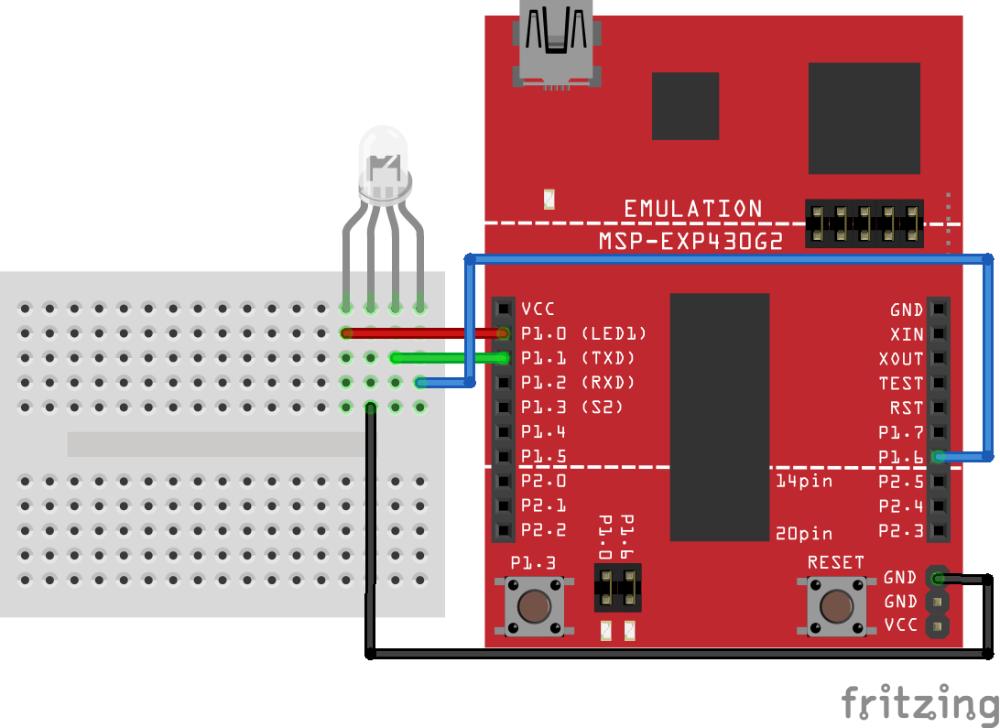
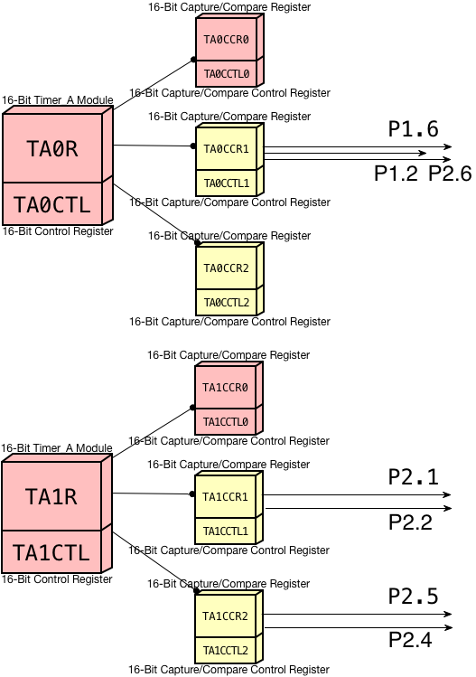

# Assignment Three: Signals

### Schematic

### Running Modes

##### Mode 0

1. Red LED blinks every 1/2 a second (using execution loop)

##### Mode 1

1. Red LED blinks every 1/2 second (using execution loop)
2. Green LED blinks every 1/3 second (using timer & interrupt)

##### Mode 2

1. Red LED turns off
2. Green LED blinks every 1/3 second (using timer & interrupt)
3. Blue LED blinks every 1/4 second (using timer & signal)

##### Mode 3

1. Red LED stays off
2. Green LED turns off
3. Blue LED blinks slower, every 1/2 second (using timer & signal)

### Objective

For this assignment, you should attempt to recreate the RGB LED activity listed above _with the method inside parenthesis_. Pressing the button should advance to the next mode (advancing from 3 should go back to 0).

Because you are using the button as an interrupt, the completed program will have some initialization, execution loop and two interrupts: one for **TIMER1_A0_VECTOR** and one for **PORT1_VECTOR**.

### Tips

I do not recommend setting hardware parameters in the execution loop based on what mode you are in (for instance, checking to see what mode you are in every loop iteration and enabling interrupts for the timer if in Mode 1 or 2, otherwise disabling interrupts if in Mode 0 or 3).

**This is a waste of time**. You should set hardware parameters _when changing modes_.

### Timers Map

Here is a map of the two timer modules and their relevant "registers":

